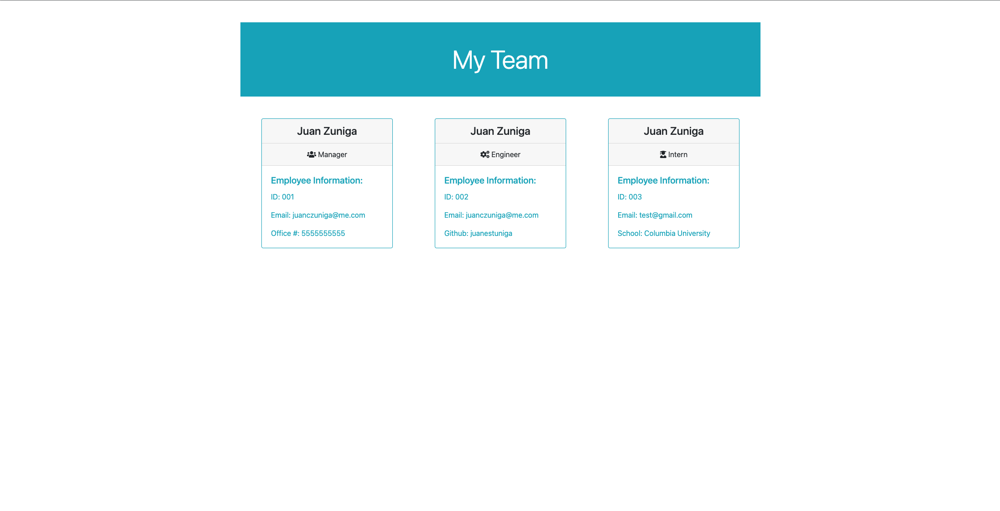

# team-profile-generator
  
  
  Check out the badges hosted by [shields.io](https://shields.io/).
  
  ## Description 
  
  
  a profile generator for a manager to display the team's basic info so that the manager can see the email and github profiles. 
  ## Table of Contents
  * [Installation](#installation)
  * [Usage](#usage)
  * [Contributing](#contributing)
  * [Tests](#tests)
  * [License](#license)
  
  ## Installation
  
  clone the repo      
  
  Run npm install    
  
  run node index     
  
  open the team.html
  
  ## Usage 
  
  
  When node index is ran the application starts with prompts in command line. 
  
  ## Contributing
  
  
  Juan Zuniga
  
  ## Tests
  
  
  run npm run test to run test
  
  ## License
  
  MIT
  
  ---
  
  ## Questions?
  
  
  For any questions, please contact me with the information below:
 
  GitHub: [@juanestuniga](https://api.github.com/users/juanestuniga)